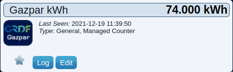

# DomoticzGazpar
Import data from GDRF to Domoticz

# create a device in Domoticz
- In Domoticz, go to hardware, create a virtual "Managed counter" or "Dummy".
  You may as well create a virtual 'Smart Meter, Gas' device in m3
- Then in Devices, add it to the devices. (mark down the id for later).
- When in Utility, edit the device and change it to Electric (instant+counter) type.

## modules to install - linux

    sudo apt-get install sqlite3
    sudo apt-get install python3 python3-dateutil python3-requests
    git clone https://github.com/onlinux/DomoticzGazpar.git

### rename configuration file, change login/pass/id

    cp _domoticz_gazpar.cfg domoticz_gazpar.cfg
    nano domoticz_gazpar.cfg

and change:

    GASPAR_USERNAME="nom.prenom@mail.com"
    GASPAR_PASSWORD="password"
    NB_DAYS_IMPORTED=30
    DOMOTICZ_ID=123
    DOMOTICZ_ID_M3=456
    DB_PATH=/home/pi/domoticz (if needed)

    [logger_root]
    level=DEBUG
    handlers=fileHandler,httpHandler

    [handler_httpHandler]
    # Add log messages to domoticz logfile
    # Access domoticz via Domoticz API/JSON URL's
    class=domoticzHandler.domoticzHandler
    # Change args as:
    #   url_of_domoticz, prefix
    args=('localhost:8080','GAZPAR')
    level=INFO

Where NB_DAYS_IMPORTED correspond to the number of days to impirt and DOMOTICZ_ID is id device on domoticz and
DOMOTICZ_ID_M3 is the id device of a virtual 'Smart Meter, Gas' device in m3 if exists

Configuration file will not be deleted in future updates.

## testing before launch

    chmod ugo+x gazpar.py

Manually launch

    ./gazpar.py

Then check the login credential if they are ok:

    cat domoticz_gazpar.log

or from domoticz Log file
In case of errors, change logging level in [handler_httpHandler] section
to DEBUG and then errors will be logged in domoticz log file or

## Add to your cron tab (with crontab -e):

    37 7,17 * * * timeout 30 /home/pi/domoticz/DomoticzGazpar/gazpar.py

Gazpar custom icons

You may now use the Zipped folder custom_icons.zip in Domoticz by uploading it in the Setup - Custom Icon menu.
